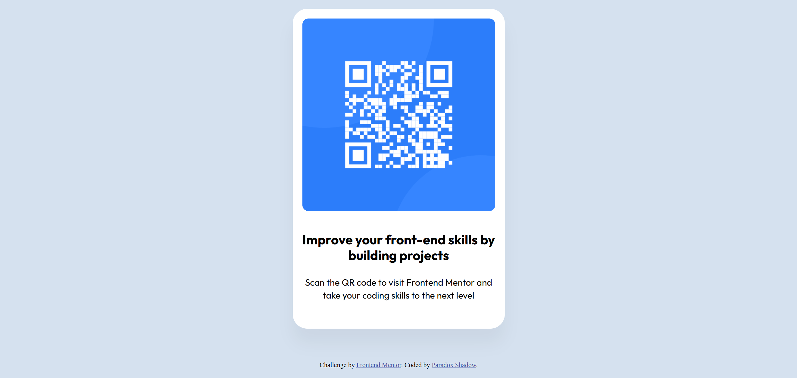

# Frontend Mentor - QR code component solution

This is a solution to the [QR code component challenge on Frontend Mentor](https://www.frontendmentor.io/challenges/qr-code-component-iux_sIO_H). Frontend Mentor challenges help you improve your coding skills by building realistic projects. 

## Table of contents

- [Overview](#overview)
  - [Screenshot](#screenshot)
  - [Links](#links)
- [My process](#my-process)
  - [Built with](#built-with)
  - [What I learned](#what-i-learned)
  - [Continued development](#continued-development)
  - [Useful resources](#useful-resources)
- [Author](#author)
- [Acknowledgments](#acknowledgments)

**Note: Delete this note and update the table of contents based on what sections you keep.**

## Overview
In this project a card element is created which contains a QR code image and text elements. The card element is centered in the middle of the viewport using grid layout. Grid layout is used further for card children elements for proper alignment. This card element is responsive and adapt to different screen sizes.
### Screenshot



**Note: Delete this note and the paragraphs above when you add your screenshot. If you prefer not to add a screenshot, feel free to remove this entire section.**

### Links

- Solution URL: [Add solution URL here](https://your-solution-url.com)
- Live Site URL: [Add live site URL here](https://your-live-site-url.com)

## My process

### Built with

- Semantic HTML5 markup
- CSS custom properties
- CSS Grid
- Mobile-first workflow

### What I learned

I have learned using CSS grid. How we can use place-items property to center the child elements inside a grid
container. I have also learnt the default behavior when we set the display to grid for any element.

```css
body {
    background-color: var(--slate-300);
    display:grid;
    place-items:center;
    gap:1.5rem;
    margin:0;
    min-height:100vh;
    
}
```

### Continued developmet
I would continue to focus on version control and responsive design in the future projects as I forget sometimes to
make regular commits. In this project as well, I have not made a single commit until I have already finished everything. Using git for version control is new to me and I want to take is full help in the future.
Also I want to enhance my abilities for responsive design using media queries and CSS grid and flexbox layout.


### Useful resources

- [CSS-Tricks: A Complete Guide to Grid](https://css-tricks.com/snippets/css/complete-guide-grid/) - This resource provided a thorough understanding of CSS Grid, which I used extensively for layout.

## Author

- Website - [Paradox Shadow](https://github.com/Taresta)
- Frontend Mentor - [Paradox](https://www.frontendmentor.io/profile/Taresta)

## Acknowledgments
I would like to acknowledge an online friend who helped me quite a bit in understanding some difficult concepts. Although they would like to remain anonymous, I would still like to thank them for all their help.
